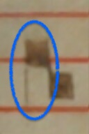
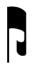
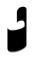
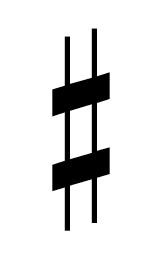

# GABC to MEI Neume Conversion

### MEI Neume Encoding: An Example
The following code block shows an example of the MEI encoding for the neumes in the word ("gloria"). The code shows one clef (`C3`) and two syllables ("glo" and "ria"), the first one ("glo") with one neume, and the second one ("ria") with two neumes. The image below shows the rendering of this MEI code in Verovio.
```xml
<staff n="1">
   <layer n="1">
      <clef shape="C" line="3"/>
      <syllable>
         <syl wordpos="s">glo</syl>
         <neume>
            <nc loc="2"/>
         </neume>
      </syllable>
      <syllable>
         <syl wordpos="m">ri</syl>
         <neume>
            <nc loc="5" tilt="n"/>
         </neume>
      </syllable>
      <syllable>
         <syl wordpos="t">a</syl>
         <neume>
            <nc loc="3"/>
         </neume>
         <neume>
            <nc loc="3" tilt="s"/>
            <nc loc="2" tilt="se"/>
            <nc loc="1" tilt="se"/>
        </neume>
      </syllable>
   </layer>
</staff>
```


For more information on how to encode chants using MEI Neumes, please consult the [MEI Guidelines - Chapter 6](https://music-encoding.org/guidelines/v5/content/neumes.html)

### Conversion Table from GABC to MEI

|    |   Class  | Strict GABC | Neumes MEI | Image | Rendition |
|----|----------|-------------|------------| ----- | --------- |
| 1  | Square (note head)                              | lowercase characters <br/>from `a` to `m` | `<nc>` |   |  |
| 2  | Rhombus                                         | uppercase characters <br/>from `A` to `M`   | `<nc`**`tilt="se"`**`/>` |   |  |
| 3  | Downward stem                                   | `V` or `v` | `<nc>` with `@tilt=n` (`ne`) or `@tilt=s` | - | - |
| 3a  | Downward stem _left side of note_              | `V` | `<nc`**`tilt="n"`**`/>` (Square notation) <br/>`<nc`**`tilt="ne"`**`/>` (Aquitanian notation) |   |  |
| 3b  | Downward stem _right side of note_             | `v` | `<nc`**`tilt="s"`**`/>` |  |  |
| 4   | Liquescent cephalicus (indicating a lower note)            | `>` | `<nc`**`curve="c" type="cephalicus"`**`>`<br/>&nbsp;&nbsp;&nbsp;&nbsp;**`<liquescent/>`**<br/>`</nc>` |    | <br/>to be implemented |
| 4a  | Liquescent _with downward stem at the left_      | `>V`<br/>(or `V>`) | `<nc`**`curve="c" tilt="n"`**`>`<br/>&nbsp;&nbsp;&nbsp;&nbsp;**`<liquescent/>`**<br/>`</nc>`<br/> (Or `@tilt=ne` in Aquitanian notation) |  |  |
| 4b  | Liquescent _with downward stem at the right_     | `>v`<br/>(or `v>`) | `<nc`**`curve="c" tilt="s" `**`>`<br/>&nbsp;&nbsp;&nbsp;&nbsp;**`<liquescent/>`**<br/>`</nc>` | no examples in our corpus |  |
| 5  | Liquescent (indicating a higher note) / Epiphonus | `<` | `<nc`**`curve="a" type="epiphonus"`**`>`<br/>&nbsp;&nbsp;&nbsp;&nbsp;**`<liquescent/>`**<br/>`</nc>` |  | <br/>to be implemented |
| 6  | Oriscus                                         | `o` | `<nc>`<br/>&nbsp;&nbsp;&nbsp;&nbsp;**`<oriscus/>`**<br/>`</nc>`  |  |  |
| 7  | Quilisma                                        | `w` | `<nc>`<br/>&nbsp;&nbsp;&nbsp;&nbsp;**`<quilisma/>`**<br/>`</nc>` |  |  |
| 8  | Strophicus                                      | `s` | `<nc>`<br/>&nbsp;&nbsp;&nbsp;&nbsp;**`<strophicus/>`**<br/>`</nc>` | no examples in our corpus | not implemented yet |
| 9  | Square with two stems down/up (Iberian notation: repeated pitch)[^1] | `9` or `6`[^2] | `<neume>` with `@type=twolegsdown` or `@type=twolegsup`, and with two identical `<nc>` as children[^3] | - | - |
| 9a | Square with two stems down | `9` | `<neume`**`type="twolegsdown">`**<br/>&nbsp;&nbsp;&nbsp;&nbsp;**`<nc @same-pitch/>`**<br/>&nbsp;&nbsp;&nbsp;&nbsp;**`<nc @same-pitch/>`**<br/>`</neume>` |  |  |
| 9b | Square with two stems up | `6` | `<neume`**`type="twolegsup">`**<br/>&nbsp;&nbsp;&nbsp;&nbsp;**`<nc @same-pitch/>`**<br/>&nbsp;&nbsp;&nbsp;&nbsp;**`<nc @same-pitch/>`**<br/>`</neume>` |  no examples in our corpus  |  |
| 10 | Lengüeta (Iberian notation: repeated pitch) | `*`[^4] | `<neume>` with `@type=lenguetadown` or `@type=lenguetaup`, and with two identical `<nc>` as children[^3] | - | - |
| 10a | Lengüeta with two stems down | `*9`<br/>(or `9*`) | `<neume`**`type="lenguetadown">`**<br/>&nbsp;&nbsp;&nbsp;&nbsp;**`<nc @same-pitch/>`**<br/>&nbsp;&nbsp;&nbsp;&nbsp;**`<nc @same-pitch/>`**<br/>`</neume>` |  |  |
| 10b | Lengüeta with two stems up | `*6`<br/>(or `6*`) | `<neume`**`type="lenguetaup">`**<br/>&nbsp;&nbsp;&nbsp;&nbsp;**`<nc @same-pitch/>`**<br/>&nbsp;&nbsp;&nbsp;&nbsp;**`<nc @same-pitch/>`**<br/>`</neume>` |  |  |
| 11 | Obliqua                     | `º` preceding first neume <br/>component of the two[^2] | `<nc`**`ligated="true"`**`/>`<br/>`<nc`**`ligated="true"`**`/>`|   |  |
| 12  | Accidentals     | `x` or `y` or `#` | `<accid>` with `@accid=f` or `@accid=n` or `@accid=s` | - | - |
| 12a | Flat     | `x` | `<accid`**`accid="f"`**`/>` |  |  |
| 12b | Natural  | `y` | `<accid`**`accid="n"`**`/>` | no examples in our corpus |  |
| 12c | Sharp    | `#` | `<accid`**`accid="s"`**`/>` | no examples in our corpus |  |
| 13 | Separation of neumes                             | `/`<br/>what precedes and follows this <br/>slash are the characters representing <br/>all neume components of one neume, <br/>and the characters of all the neume <br/>components of the following neume, <br/>respectively | **`<neume>`**<br/>&nbsp;&nbsp;&nbsp;&nbsp;`<nc/>...<nc/>`<br/>**`</neume>`<br/>`<neume>`**<br/>&nbsp;&nbsp;&nbsp;&nbsp;`<nc/>...<nc/>`<br/>**`</neume>`** | - | - |
| 14 | Uncertain reading <br/>unclear neume components   | `r`[^4] | `<nc>`<br/>&nbsp;&nbsp;&nbsp;&nbsp;**`<unclear/>`**<br/>`</nc>` | - | - |
| 15 | Completely illegible / lacuna: | `text()`<br/>no content inside the pair of <br/>parentheses | `<syllable>`<br/>&nbsp;&nbsp;&nbsp;&nbsp;`<syl>text</syl>`<br/>&nbsp;&nbsp;&nbsp;&nbsp;`<gap></gap>`<br/>`</syllable>` <br/><br/>**no child `<neume>`** inside of `<syllable>`, **we use `<gap>` instead** | - | - |

#### Notes:

* Entries ***9*** and ***10*** (table above) imply a neume with two neume components with the same pitch.

   > In Iberian square notation, the square punctum with two tails (either up or down) **doesn't represent a liquescent** (as in other notations) but rather two repeated notes.

   This is why it is encoded as such in the table above (see entries *9a* and *9b*). Occasionally, there could be an extra short stroke between the two tails, known as lengüeta in the literature (see entries *10a* and *10b* above); however, its use doesn't change its interpretation. For both *square with two stem* (*9a* and *9b*) and *lengueta* entries (*10a* and *10b*), the `@same-pitch` is not a real, valid attribute in MEI, but it is meant to represent the use of attributes that provide the same pitch for both neume components `<nc>`. This is done by, for example, using the same `@panme` and `@oct` attributes in the two neume components, or the same `@loc`.

* **Liquescents**, on the other hand, are represented with the GABC symbols `<` or `>`. 
   * The use of a regular `<` implies an epiphonus (higher liquescent, with `@curve = a` and `@type = epiphonus`). 
   * The use of a regular `>` implies a cephalicus (downward liquescent, with `@curve = c` and `@type = cephalicus`).
   * However, if the `>` is combined with either `V` (stem left) or `v` (stem right); these are read more like a liquescent virga, therefore, the `@type = cephalicus` is removed and substituted by `@tilt = n` (if `V`) or `@tilt = s` (if `v`). 

   These are all internal conventions from our project on how to interpret these combination of symbols and their conversion to MEI.

[^1]: The same symbol is used as liquescent (to a lower or upper note) in other notations (like the examples shown in 4 or 5), but not in Iberian notation, where it means a repeated pitch. 

[^2]: Not part of GABC.

[^3]: For the two sub-entries of *square with two stems* (*9a* and *9b*) and the two sub-entries of *lengueta* (*10a* and *10b*), the `@same-pitch` in the two neume components `<nc>` of the `<neume>` is not a **real, valid attribute in MEI**, but it is used here as a shortcut to represent the use of pitch-related attributes (e.g., `@pname` and `@oct`, or `@loc`) that notate the exact same pitch for both neume components in the neume as these are supposed to be neumes "with two identical `<nc>` as children".

[^4]: Different use in GABC.
